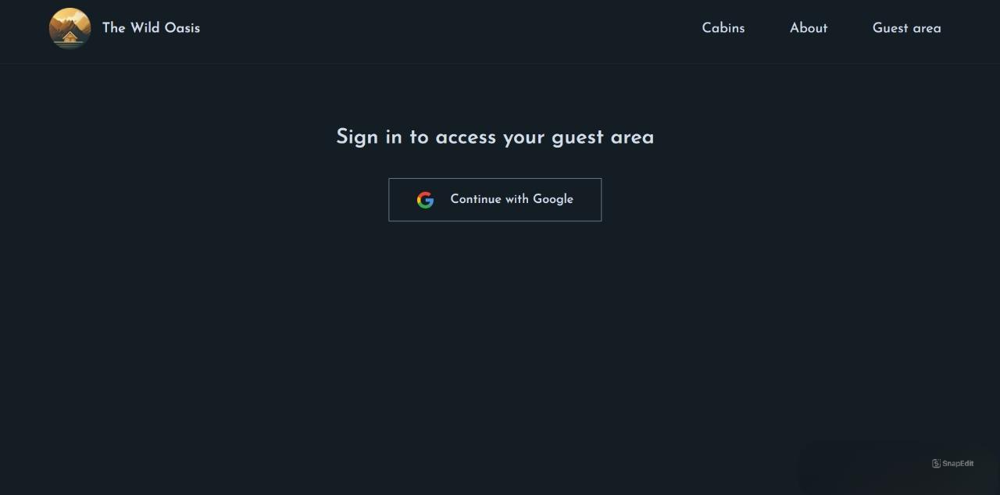
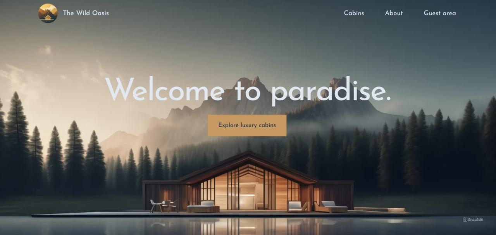
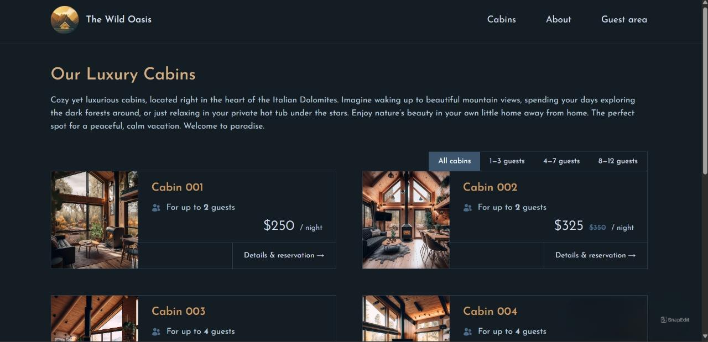
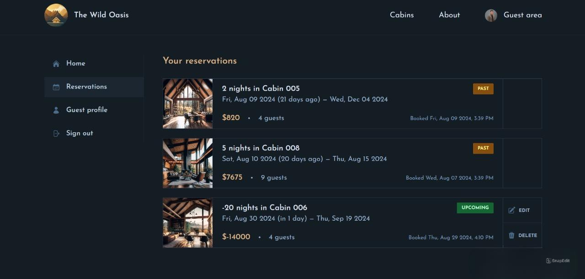
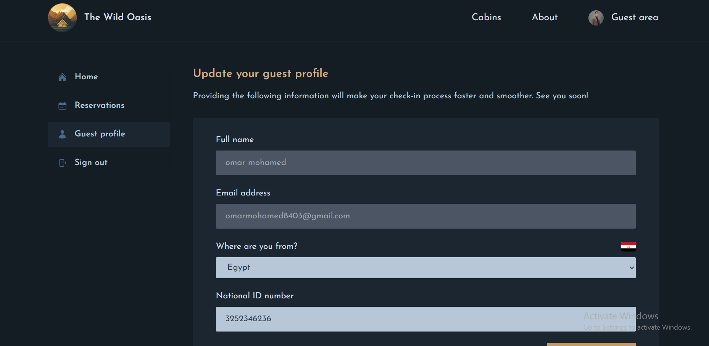

# The Wild Oasis For Client

**The Wild Oasis** is a hotel booking application that allows guests to manage their cabin bookings, additional options like breakfast, and the duration of stays. The app includes a user authentication for secure access.

## Table of Contents
- [Features](#features)
- [Technologies Used](#technologies-used)
- [Getting Started](#getting-started)
- [Screenshots](#screenshots)
- [Contact](#contact)

## Features
- **Cabin Booking Management**: Guests can book cabins with or without breakfast.
- **Customizable Stays**: Guests can specify the number of days for their stay.
- **Checkout and Payment**: Manage the billing and payment process upon checkout.
- **User Authentication**: Secure login and registration functionality for guests.
- **Profile Management**: Guests can update their profile information, including country and national ID.

## Technologies Used
- **Frontend**: Next.js , Tailwind CSS
- **State Management**: React Context API 
- **Backend**: Supabase (for authentication and database)
- **Styling**: Tailwind CSS

## Usage
- **Booking Management**: Guests can log in and manage their bookings, including adding new bookings, updating existing ones, and handling payments.
- **Profile Management**: Guests can update their country and national ID through the profile page.

## Screenshots
Include some screenshots of my app to show the UI and its features.

## Contact
If you have any questions or feedback, feel free to reach out:

- **Email**: [omarmohamed8403@gmail.com]
- **LinkedIn**: [https://www.linkedin.com/in/omar-mohamed-611773292]
